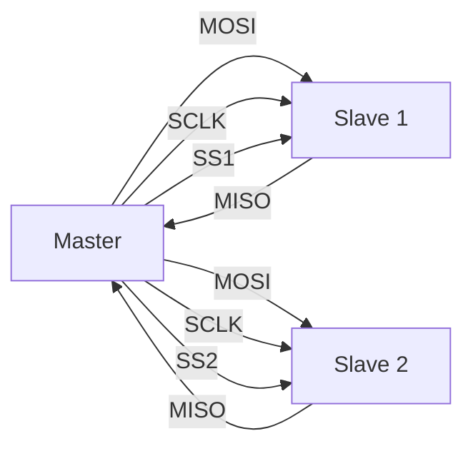
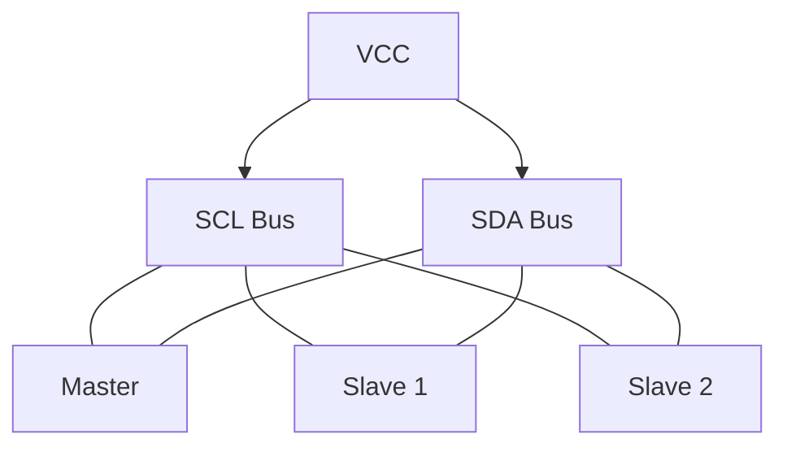
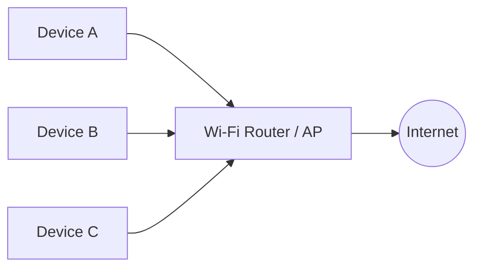
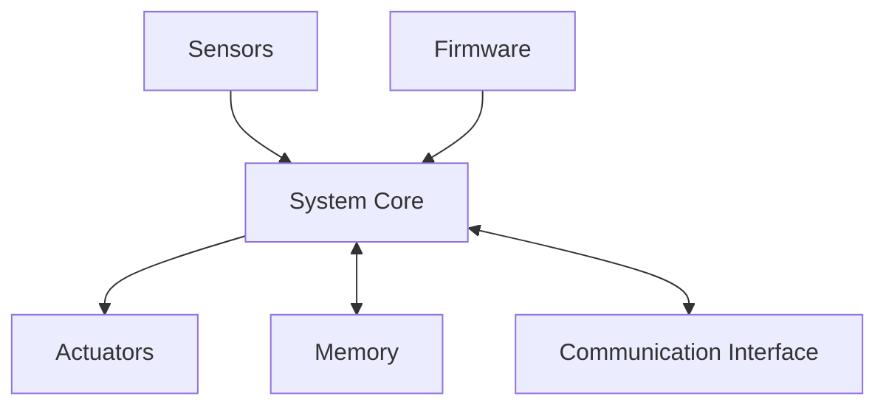

# Module-1 Embedded Systems — Focused Exam Answers

---

## Q1. Comparison of Embedded System and General Computing System

| Parameter | General Purpose Computing System | Embedded System |
|---|---|---|
| Definition | Combination of generic hardware + GPOS for running variety of applications | Combination of special-purpose hardware + embedded OS for a specific application |
| OS | Always has a General Purpose OS (Windows, Linux, etc.) | May or may not have an OS |
| Firmware/Application | User can install, remove, or modify applications freely | Firmware is pre-programmed and non-alterable by the end user |
| Performance focus | "Faster is better" — performance is the key deciding factor | Application-specific requirements (power, memory, response) are the key factors |
| Power management | Not tailored for power saving | Highly tailored to use hardware/OS power saving modes |
| Response time | Not time-critical | Can be time-critical (especially mission-critical systems) |
| Determinism | Not necessarily deterministic | Deterministic for Hard Real Time systems |

**Key reasoning:**
1. A general computing system is generic; an embedded system is domain-specific.
2. The firmware of an embedded system is locked — the end user cannot change it.
3. Power, response time, and determinism matter far more in embedded systems.

---

## Q2. Characteristics of an Embedded System

1. **Application and Domain Specific**
   Each embedded system is designed for a specific function only. Example: a microwave oven controller cannot replace an air conditioner controller.

2. **Reactive and Real Time**
   Embedded systems constantly interact with the real world via sensors. Events from the environment trigger a designed response — hence they are *reactive systems*. Real Time operation means timing behaviour is deterministic; no deadlines should be missed. (Not all embedded systems need to be real time — e.g., electronic toys.)

3. **Operates in Harsh Environments**
   Deployed environments may involve dust, high temperature, vibration, shock, power fluctuations, corrosion, and component ageing. The system must withstand all such conditions.

4. **Distributed**
   An embedded system may be part of a larger system where multiple independent embedded units work together.
   - ATM: card reader unit + transaction unit + currency counter + printer unit.
   - SCADA: physically distributed control units connected to a supervisory module.

5. **Small Weight and Size**
   Product aesthetics and portability demand compact, lightweight designs. "Small is beautiful."

6. **Power Concerns**
   Power management is critical — especially for battery-operated devices. Low power components (low dropout regulators, processors with power-saving modes) should be selected. Minimising heat dissipation is essential to avoid bulky cooling requirements.

**Key reasoning:**
- These 6 characteristics collectively distinguish embedded systems from general computers — they are driven by application needs, real-world interaction, physical constraints, and deployment conditions.

---

## Q3. Memory Storage of 32-bit data `3D7A2390H` — Little Endian & Big Endian

**Starting address:** 0x30000  
**Data:** `3D 7A 23 90` (Byte3=3D, Byte2=7A, Byte1=23, Byte0=90)

### Little-Endian (Least significant byte at lowest address)

| Address  | Data Byte |
|----------|-----------|
| 0x30000  | 90        |
| 0x30001  | 23        |
| 0x30002  | 7A        |
| 0x30003  | 3D        |

### Big-Endian (Most significant byte at lowest address)

| Address  | Data Byte |
|----------|-----------|
| 0x30000  | 3D        |
| 0x30001  | 7A        |
| 0x30002  | 23        |
| 0x30003  | 90        |

**Diagrammatic representation:**

```
                LITTLE-ENDIAN              BIG-ENDIAN
Address         Data                       Data
0x30000    ┌──────────┐               ┌──────────┐
           │    90    │  (Byte 0)     │    3D    │  (Byte 3)
0x30001    ├──────────┤               ├──────────┤
           │    23    │  (Byte 1)     │    7A    │  (Byte 2)
0x30002    ├──────────┤               ├──────────┤
           │    7A    │  (Byte 2)     │    23    │  (Byte 1)
0x30003    ├──────────┤               ├──────────┤
           │    3D    │  (Byte 3)     │    90    │  (Byte 0)
           └──────────┘               └──────────┘
```

**Key reasoning:**
1. Split the 32-bit value into 4 bytes: `3D`, `7A`, `23`, `90` (MSB to LSB).
2. Little-Endian → LSB (`90`) goes to lowest address; Big-Endian → MSB (`3D`) goes to lowest address.
3. Example processor: Intel x86 = Little-Endian; Motorola 68000 = Big-Endian.

---

## Q4. SPI (Serial Peripheral Interface) Communication Protocol

- **Type:** Synchronous, bi-directional, **full duplex**, four-wire serial bus.
- **Introduced by:** Motorola.
- **Architecture:** Single master, multi-slave (only one master active at a time).

### Four Signal Lines

| Signal | Full Form | Direction | Function |
|--------|-----------|-----------|----------|
| MOSI | Master Out Slave In | Master → Slave | Data from master to slave |
| MISO | Master In Slave Out | Slave → Master | Data from slave to master |
| SCLK | Serial Clock | Master → Slave | Clock generated by master |
| SS | Slave Select | Master → Slave | Active LOW — selects which slave is active |

### SPI Bus Diagram



### Operation
- Master generates SCLK; selects slave by asserting its SS line LOW.
- Unselected slaves keep their MISO lines at high impedance.
- Data is exchanged simultaneously on MOSI and MISO (full duplex).

### SPI Device Registers
- **Control Register:** Holds master/slave selection, baud rate, clock control settings.
- **Status Register:** Holds transmission and reception status conditions.

**Key reasoning:**
1. SS (active LOW) selects one slave at a time — each slave has its own SS line.
2. Full duplex means data flows both ways simultaneously (MOSI and MISO).
3. Clock is always from master; slaves cannot initiate communication.

---

## Q5. Super Loop Based Embedded Firmware Approach

- Adopted for applications that are **not time-critical** and where response time is not critical.
- Executes tasks **serially** in a fixed, infinite loop — hence called "Super Loop."

### Execution Flow
1. Configure common parameters and perform initialisation.
2. Execute Task 1.
3. Execute Task 2.
4. ...
5. Execute Task N.
6. Jump back to Task 1 and repeat.

### Equivalent C Code
```c
void main()
{
    Configurations();
    Initializations();
    while(1)
    {
        Task_1();
        Task_2();
        :
        Task_n();
    }
}
```

- The only exit from the loop is a **hardware reset** (returns to main loop) or an **interrupt** (suspends current task → ISR executes → resumes).

### Advantages
- Does not require an operating system.
- No scheduling or priority assignment needed.
- Execution order is fixed and predictable.

### Applications
- Low-cost products where response time is not critical.
- Inherently sequential tasks (e.g., card reader: check card → authenticate → read/write).
- Example: electronic video game toy (reads keypad, updates display).

### Drawbacks
- Failure in any single task affects the entire system (program hang = product stops). WDTs can help but add cost.
- **Lack of real timeliness:** As tasks increase, loop iteration time increases — probability of missing events rises. A user may have to hold a keypress long enough for the keypad-scan task to run.

**Key reasoning:**
1. The `while(1)` loop never ends; tasks run one after another in fixed order.
2. No OS → no scheduler, no preemption.
3. Not suitable when tasks have strict timing requirements.

---

## Q6. Availability Calculation (MTBF = 4 months, MTTR = 2 weeks)

**Formula:**
$$A_i = \frac{MTBF}{MTBF + MTTR}$$

**Given:**
- MTBF = 4 months = **120 days**
- MTTR = 2 weeks = **14 days**

**Calculation:**
$$A_i = \frac{120}{120 + 14} = \frac{120}{134}$$

$$\boxed{A_i = 0.8955 \approx 89.55\%}$$

**Key reasoning:**
1. Convert all units to the same unit (days).
2. Plug into the formula: Availability = MTBF / (MTBF + MTTR).
3. Higher MTBF (less frequent failures) and lower MTTR (faster repair) → higher availability.

---

## Q7. I²C (Inter-Integrated Circuit) Communication Protocol

- **Type:** Synchronous, bi-directional, **half duplex**, **two-wire** serial bus.
- **Developed by:** Philips Semiconductors (early 1980s, originally for TV peripheral chips).

### Two Bus Lines

| Line | Full Form | Function |
|------|-----------|----------|
| SCL | Serial Clock Line | Generates synchronisation clock pulses (always by master) |
| SDA | Serial Data Line | Transmits serial data |

### I²C Bus Diagram



*Pull-up resistors are required on both SCL and SDA lines.*

### Key Features
- Shared bus — many I²C devices can connect to the same two wires.
- Devices act as **Master** or **Slave**. Master initiates/terminates transfer and generates clock; slave responds.
- Both can act as transmitter or receiver. Supports **multi-master** on same bus.
- Slaves are identified by a **7-bit or 10-bit address**.

### I²C Communication Sequence
1. Master asserts SCL HIGH; pulls SDA LOW while SCL is HIGH → **Start condition**.
2. Master sends 7-bit (or 10-bit) slave address MSB first over SDA; clock pulses on SCL.
3. Master sends **Read (1)** or **Write (0)** bit.
4. Master waits for **Acknowledge** bit from the addressed slave.
5. Addressed slave drives SDA LOW → Acknowledgement.
6. **Write:** Master sends 8-bit data; slave acknowledges each byte.
   **Read:** Slave sends data; master acknowledges.
7. Master pulls SDA HIGH while SCL is HIGH → **Stop condition**.

**Key reasoning:**
1. Only 2 wires needed regardless of how many devices are on the bus.
2. Start and Stop conditions are distinguished by the state of SDA relative to SCL.
3. Every byte is followed by an acknowledgement bit from the receiver.

---

## Q8. MTTR Calculation (Availability = 90%, MTBF = 30 days)

**Formula:**
$$A_i = \frac{MTBF}{MTBF + MTTR}$$

**Given:**
- $A_i$ = 90% = 0.9
- MTBF = 30 days

**Rearranging:**
$$MTBF + MTTR = \frac{MTBF}{A_i}$$

$$MTTR = \frac{MTBF}{A_i} - MTBF = \frac{30}{0.9} - 30 = 33.33 - 30$$

$$\boxed{MTTR = 3.33 \text{ days} \approx 80 \text{ hours}}$$

**Key reasoning:**
1. Rearrange the availability formula to isolate MTTR.
2. 3.33 days × 24 hours = 80 hours.

---

## Q9. Operational Quality Attributes of Embedded System

Operational quality attributes are non-functional requirements related to the system **when it is in operational/online mode**. There are 6 attributes:

### 1. Response
- Measure of the **quickness** of the system — how fast it tracks changes in input.
- Flight control systems require real-time response; delay creates safety hazards.
- Not all embedded systems need to be real time (e.g., electronic toy).

### 2. Throughput
- Measures the **efficiency** of the system — rate of production or operation over a time period.
- Example: how many transactions a card reader performs per minute/hour.
- Measured using **Benchmarks** (reference standards for comparison).

### 3. Reliability
- Measure of how much you can rely on the system functioning properly.
- Defined using:
  - **MTBF (Mean Time Between Failures):** Frequency of failures (in hours/weeks/months).
  - **MTTR (Mean Time To Repair):** How long the system is allowed to be out of order after a failure. For critical systems: order of minutes.

### 4. Maintainability
- Deals with support and maintenance for technical issues, failures, or routine check-ups.
- **Preventive (Scheduled):** Replacing printer cartridge after *n* printouts.
- **Corrective:** Repairing a printer when the paper feed fails.
- Also indicates **Availability** of the product:

$$A_i = \frac{MTBF}{MTBF + MTTR}$$

### 5. Security
Three major measures:
- **Confidentiality:** Protecting data from unauthorised **disclosure**.
- **Integrity:** Protecting data from unauthorised **modification**.
- **Availability:** Protecting data from **unauthorized access**.

Example: A shared-lab PDA uses username/password (Availability), admin vs user roles (Confidentiality), read-only for all users (Integrity).

### 6. Safety
- Deals with possible damage to **operators, public, and environment** due to hardware/firmware failure or hazardous emissions.
- Safety analysis is mandatory in product engineering to evaluate and reduce anticipated damage.
- Some threats are sudden (product breakdown); others are gradual (hazardous emissions).

**Key reasoning:**
- These 6 attributes define how well the system performs, how reliable it is, how safe it is, and how securely it handles data — all while it is running.

---

## Q10. Wi-Fi Communication Interface

- Popular wireless communication interface for networked devices.
- Follows **IEEE 802.11** standard.
- Supports **IP-based communication** — each device has a unique IP address.
- Requires a **Wi-Fi router / Wireless Access Point** that manages communication, assigns IP addresses, and routes data packets.
- Operates at **2.4 GHz or 5 GHz** (co-exists with Bluetooth and other ISM-band devices).

### Security Mechanisms
- **WEP** (Wired Equivalency Privacy)
- **WPA** (Wireless Protected Access)

### Data Rate and Range

| Attribute | Value |
|-----------|-------|
| Data Rate | 1 Mbps to 1.73 Gbps (varies with standard: 802.11a/b/g/n/ac) |
| Range | 100 to 1000 feet (depends on antenna and indoor/outdoor usage) |

### Wi-Fi Network Diagram



### Connection Process
1. Device turns on Wi-Fi radio.
2. Searches available networks; lists SSIDs.
3. User selects SSID.
4. Enters password (if security enabled).
5. Device gets connected and assigned an IP address.

**Key reasoning:**
1. The router is the central point that manages all communication and internet access.
2. IP address uniquely identifies each device on the network.
3. 2.4 GHz = longer range, slower speed; 5 GHz = shorter range, faster speed.

---

## Q11. Memory Storage of 32-bit data `56AB98FCH` — Little Endian & Big Endian

**Starting address:** 0x20000  
**Data:** `56 AB 98 FC` (Byte3=56, Byte2=AB, Byte1=98, Byte0=FC)

### Little-Endian (Least significant byte at lowest address)

| Address  | Data Byte |
|----------|-----------|
| 0x20000  | FC        |
| 0x20001  | 98        |
| 0x20002  | AB        |
| 0x20003  | 56        |

### Big-Endian (Most significant byte at lowest address)

| Address  | Data Byte |
|----------|-----------|
| 0x20000  | 56        |
| 0x20001  | AB        |
| 0x20002  | 98        |
| 0x20003  | FC        |

### Diagrammatic Representation

```
                LITTLE-ENDIAN              BIG-ENDIAN
Address         Data                       Data
0x20000    ┌──────────┐               ┌──────────┐
           │    FC    │  (Byte 0)     │    56    │  (Byte 3)
0x20001    ├──────────┤               ├──────────┤
           │    98    │  (Byte 1)     │    AB    │  (Byte 2)
0x20002    ├──────────┤               ├──────────┤
           │    AB    │  (Byte 2)     │    98    │  (Byte 1)
0x20003    ├──────────┤               ├──────────┤
           │    56    │  (Byte 3)     │    FC    │  (Byte 0)
           └──────────┘               └──────────┘
```

**Key reasoning:**
1. Split 32-bit value into 4 bytes from MSB to LSB: `56`, `AB`, `98`, `FC`.
2. Little-Endian: LSB (`FC`) → lowest address; Big-Endian: MSB (`56`) → lowest address.

---

## Q12. Core of an Embedded System (with Diagram)

The core of an embedded system is the **master brain** — a single chip controller/processor supported by memory, communication interfaces, I/O ports, and other subsystems.

### Elements of the Core

The controller can be any of:
- **Microprocessor**
- **Microcontroller**
- **FPGA (Field Programmable Gate Array)**
- **DSP (Digital Signal Processor)**
- **ASIC / ASSP (Application Specific Integrated Circuit / Standard Product)**

### Embedded System Block Diagram



Original ASCII diagram removed.

                    │                                        │
  Sensors ─────────►│         ┌─────────────────┐           │
  (Input ports)     │         │   System Core   │           │──────► Actuators
                    │         │ (Microprocessor /│           │       (Output ports)
                    │         │  Microcontroller/│           │
                    │         │  FPGA / DSP /   │           │
                    │         │  ASIC)          │           │
                    │         └────────┬────────┘           │
                    │                  │                     │
                    │    ┌─────────────┼─────────────┐      │
                    │    │             │              │      │
                    │  Memory   Communication    Other ICs   │
                    │  (ROM/RAM)  Interface     & Subsystems │
                    │             (I2C, SPI,                 │
                    │            UART, Wi-Fi)                │
                    │                                        │
                    │         Embedded Firmware              │
                    └────────────────────────────────────────┘
```

### Components of the Core

| Component | Role |
|-----------|------|
| Processor / Controller | Executes firmware; controls all peripherals |
| Memory (ROM) | Stores firmware/control algorithm (OTP, PROM, EEPROM, FLASH) |
| Memory (RAM) | Working memory for temporary data (SRAM, DRAM, NVRAM) |
| Input Ports (Sensors) | Capture real-world events (temperature, pressure, etc.) |
| Output Ports (Actuators) | Produce physical actions in response (motors, LEDs, etc.) |
| Communication Interfaces | Onboard: I²C, SPI, UART; External: Bluetooth, Wi-Fi, USB |
| Embedded Firmware | Software that imparts intelligence to the system |

### How It Works
- The embedded system is a **reactive system** — it processes input from sensors/user interfaces and drives actuators to regulate a physical variable.
- Common user input devices: keyboards, push-button switches.
- Common user output devices: LEDs, LCDs, piezoelectric buzzers.
- Firmware is stored in ROM; working data is held in RAM.

**Key reasoning:**
1. The processor/controller is the brain; without firmware it does nothing.
2. Sensors feed data in; actuators produce output — the core processes the in-between.
3. Communication interfaces allow the embedded system to interact with other devices or the internet.

---

*Answers compiled from Module-1 notes (ECE23601). All numerical examples and definitions are sourced directly from the provided notes.*
