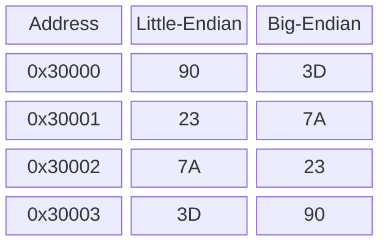
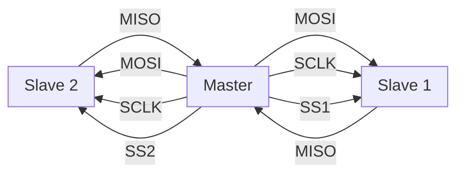
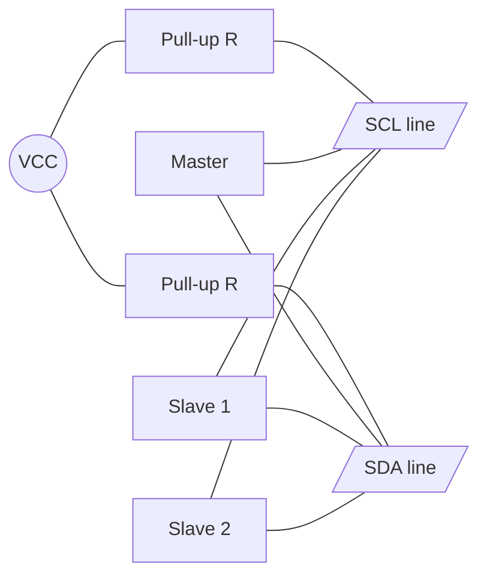
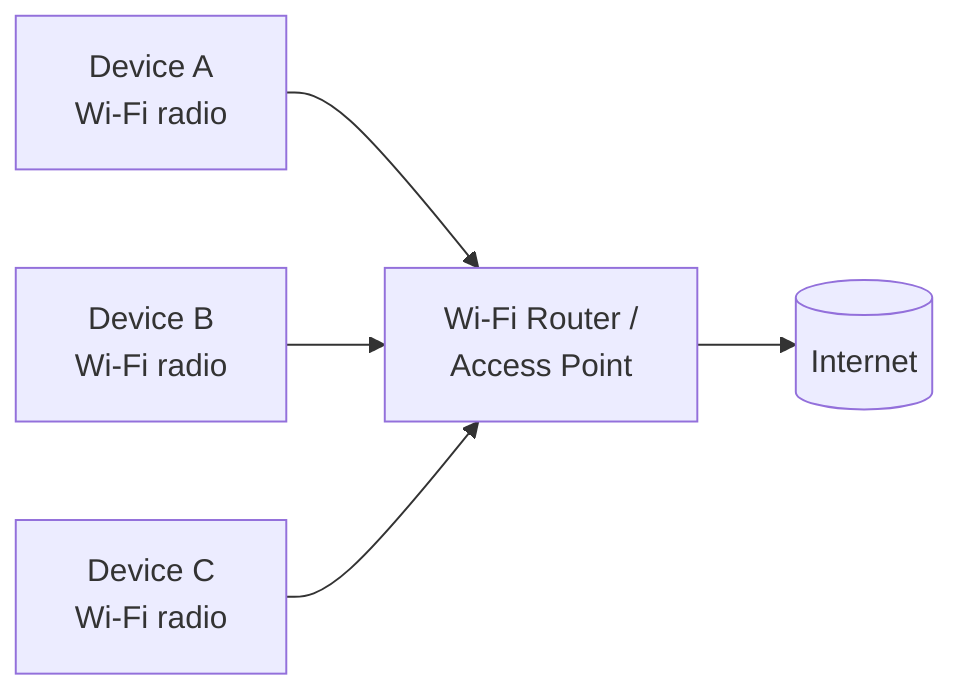
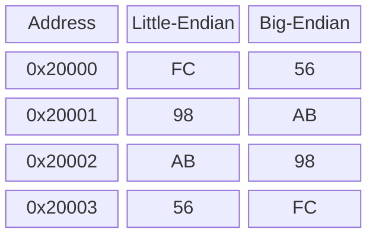
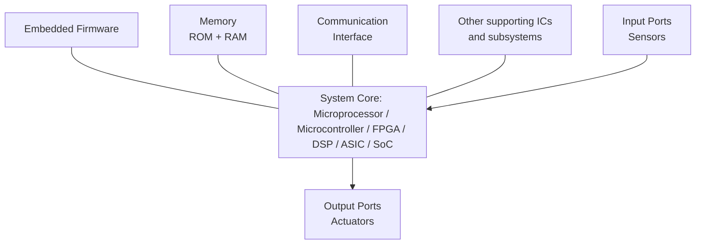

# Embedded Systems (ECE23601) — Module-1 Focused Answers

> Answers based strictly on the Module-1 notes provided. Where I add anything beyond the notes, it is explicitly flagged as **[Beyond notes]**.

---

## Q1. Comparison of Embedded System and General Computing System

| **General Purpose Computing System** | **Embedded System** |
|---|---|
| Combination of generic hardware and a General Purpose OS for executing a variety of applications | Combination of special purpose hardware and embedded OS for executing a specific set of applications |
| Contains a General Purpose Operating System (GPOS) | May or may not contain an operating system |
| Applications are alterable (programmable) by the user — OS can be re-installed, apps added/removed | Firmware is pre-programmed and non-alterable by the end-user (exceptions: OS kernel image flashing via special hardware settings) |
| Performance is the key deciding factor — "Faster is Better" | Application-specific requirements (performance, power, memory usage) are the key deciding factors |
| Less/not tailored toward reduced operating power | Highly tailored to use power-saving modes of hardware and OS |
| Response requirements are not time-critical | For mission-critical embedded systems, response time is highly critical |
| Need not be deterministic in execution | Execution is deterministic for types like 'Hard Real Time' systems |

**Step-by-step reasoning:**
1. A general system pairs *generic* hardware with a GPOS; an embedded system pairs *special-purpose* hardware with an (optional) embedded OS.
2. The user can reprogram a general system; embedded firmware is fixed.
3. General systems optimise for raw speed; embedded systems optimise for application-specific constraints (power, memory, timing).
4. The hard constraints (deterministic timing, low power) come from the embedded system's fixed, dedicated purpose.

---

## Q2. Characteristics of an Embedded System

The six important characteristics:

1. **Application and Domain Specific** — Each embedded system is built to do only its intended function and cannot be used for any other purpose. *Example:* a microwave oven's control unit cannot replace an air conditioner's control unit.
2. **Reactive and Real Time** — Constantly interacts with the real world through sensors/input devices. Any real-world change (an **Event**) is captured in Real Time and the control algorithm reacts in a designed way (hence **Reactive System**). A **Real Time** system has deterministic timing — it responds within a known time and must not miss deadlines (e.g., flight control, ABS). *Not all embedded systems are Real Time.*
3. **Operates in Harsh Environment** — May face dust, high temperature, vibration, shock, supply fluctuations, corrosion, and component aging; must withstand these conditions.
4. **Distributed** — May be a part of a larger system made of independent units working together. *Examples:* ATM (card reader + transaction unit + currency counter + printer), vending machine, SCADA.
5. **Small Size and Weight** — Product aesthetics matter ("small is beautiful"); most applications demand small, low-weight products.
6. **Power Concerns** — Must minimise heat dissipation; high heat needs bulky cooling; use low-power components and processors with power-saving modes; critical for battery-operated devices.

**Step-by-step reasoning:**
1. An embedded system exists for one job → *application/domain specific*.
2. It senses real-world events and reacts within deadlines → *reactive + real time*.
3. It is often deployed in the field → must survive a *harsh environment*.
4. It is frequently one block of a bigger machine → *distributed*.
5. Market/aesthetics + deployment constraints → *small size/weight* and *low power*.

---

## Q3. Storage of 32-bit data 3D7A2390 at address 0x30000 (Little vs Big Endian)

Split the 32-bit word `3D 7A 23 90` into bytes (highest-order → lowest-order):

| Byte name | Value |
|---|---|
| Byte 3 (MSB, highest order) | 3D |
| Byte 2 | 7A |
| Byte 1 | 23 |
| Byte 0 (LSB, lowest order) | 90 |

**Little-Endian** — lowest-order byte (Byte 0) stored at the lowest address:

| Memory Address | Content |
|---|---|
| 0x30000 | 90 |
| 0x30001 | 23 |
| 0x30002 | 7A |
| 0x30003 | 3D |

**Big-Endian** — highest-order byte (Byte 3) stored at the lowest address:

| Memory Address | Content |
|---|---|
| 0x30000 | 3D |
| 0x30001 | 7A |
| 0x30002 | 23 |
| 0x30003 | 90 |



**Step-by-step reasoning:**
1. Write the word in bytes: MSB = 3D, then 7A, 23, LSB = 90.
2. **Little-endian** = "little end (LSB) first" → put 90 at the lowest address 0x30000, going up to 3D at 0x30003.
3. **Big-endian** = "big end (MSB) first" → put 3D at the lowest address 0x30000, going up to 90 at 0x30003.

---

## Q4. SPI Communication Protocol

**SPI (Serial Peripheral Interface)** is a **synchronous, bi-directional, full-duplex, four-wire** serial interface bus, introduced by **Motorola**. It is a **single-master, multi-slave** system (only one master active at a time).

**Four signal lines:**

| Line | Full form | Function |
|---|---|---|
| **MOSI** | Master Out Slave In (SI/SDI) | Data from master to slave |
| **MISO** | Master In Slave Out (SO/SDO) | Data from slave to master |
| **SCLK** | Serial Clock | Clock signal generated by master |
| **SS** | Slave Select (active low) | Selects the slave device |

**Operation:**
- The master generates the clock signal and selects a slave by asserting that slave's **SS line LOW**.
- The MISO lines of unselected slaves float at **high impedance**.
- Because it is full-duplex, data shifts out on MOSI and in on MISO simultaneously under SCLK.

**SPI configuration registers in devices:**
- **Control register** — holds master/slave selection, baud rate, clock control.
- **Status register** — holds transmission and reception status.



**Step-by-step reasoning:**
1. SPI uses 4 wires; 3 are shared (MOSI, MISO, SCLK) and each slave gets its own SS line.
2. Master drives the clock (synchronous) and picks a slave by pulling its SS low.
3. Full-duplex: one data line each direction → simultaneous send and receive.
4. Unselected slaves release MISO (high-Z) so they don't conflict on the shared bus.

---

## Q5. Super Loop Based Embedded Firmware Approach

The **Super Loop** approach (conventional procedural design) is adopted for applications that are **not time critical** and where response time is not important. Code executes **task by task, serially**, inside an infinite loop.

**Execution flow:**
1. Configure common parameters and perform initialisation.
2. Execute Task 1, then Task 2, ... up to Task n.
3. Jump back to Task 1 and repeat forever.

**Equivalent C code:**
```c
void main()
{
    Configurations();
    Initializations();
    while(1)
    {
        Task_1();
        Task_2();
        :
        Task_n();
    }
}
```

The execution order is **fixed and hard-coded** in an infinite ("super") loop. The only exit is a **hardware reset** (returns to the main loop) or an **interrupt** (suspends the current task, runs the ISR, then resumes).

**Advantages:**
- Does not require an operating system.
- No need for scheduling or priority assignment.
- Priorities and execution order are fixed and hard-coded.

**Applications:** Low-cost products where response time is not critical; inherently sequential tasks (e.g., card reader: check card → authenticate → read/write); electronic video game toy.

**Drawbacks:**
- A failure in any single task can hang/stop the whole system (Watch Dog Timers help but add cost/overhead).
- **Lack of real timeliness:** as the number of tasks grows, time per loop repetition grows, raising the chance of missing events (e.g., a keypress may be missed unless held long enough). Interrupts can handle urgent external events.

**Step-by-step reasoning:**
1. Initialise once, then loop tasks endlessly in a fixed order.
2. No OS/scheduler is needed because order is hard-coded.
3. This is simple and cheap but not real-time: more tasks → slower loop → missed events.
4. Reset or interrupts are the only ways to break the normal flow.

---

## Q6. Availability — MTBF = 4 months, MTTR = 2 weeks

**Given:** MTBF = 4 months = 120 days; MTTR = 2 weeks = 14 days.

$$A_i = \frac{MTBF}{MTBF + MTTR} = \frac{120}{120 + 14} = \frac{120}{134}$$

$$\boxed{A_i = 0.8955 \approx 89.55\%}$$

**Step-by-step reasoning:**
1. Convert to common units: 4 months = 120 days, 2 weeks = 14 days.
2. Apply availability formula $A_i = MTBF/(MTBF+MTTR)$.
3. $120/134 = 0.8955$ → **89.55%**.

---

## Q7. I²C Communication Protocol

**I²C (Inter-Integrated Circuit)** is a **synchronous, bi-directional, half-duplex, two-wire** serial interface bus, developed by **Philips Semiconductors** in the early 1980s.

**Two bus lines:**

| Line | Full form | Function |
|---|---|---|
| **SCL** | Serial Clock Line | Carries synchronisation clock pulses |
| **SDA** | Serial Data Line | Carries serial data |

**Key features:**
- Shared bus — many I²C devices connect to the same two lines.
- Devices act as **Master** (initiates/terminates transfer, sends data, generates clock) or **Slave** (waits for commands and responds).
- Both master and slave can be transmitter or receiver.
- The clock is **always generated by the master**; supports **multi-masters**.

**Communication sequence:**
1. Master pulls SCL HIGH.
2. Master pulls SDA LOW while SCL is HIGH → **Start condition**.
3. Master sends 7-bit (or 10-bit) slave address on SDA (MSB first), clocked by SCL; data valid during the HIGH period of the clock.
4. Master sends the **Read (1) / Write (0)** bit.
5. Master waits for the acknowledgement bit.
6. Addressed slave responds with the acknowledge bit.
7. **Write:** master sends 8-bit data to slave. **Read:** slave sends data to master.
8. Acknowledgement follows each byte (master ACKs on read; slave ACKs on write).
9. Master pulls SDA HIGH while SCL is HIGH → **Stop condition**.



**Step-by-step reasoning:**
1. Only two shared, pull-up lines: SCL (clock) and SDA (data).
2. Master starts by pulling SDA low while SCL is high (Start).
3. Master addresses a slave, sets R/W, and exchanges ACK-checked bytes.
4. Master ends by pulling SDA high while SCL is high (Stop). Half-duplex: one data line, one direction at a time.

---

## Q8. MTTR — Availability = 90%, MTBF = 30 days

**Given:** $A_i$ = 90% = 0.9; MTBF = 30 days.

$$A_i = \frac{MTBF}{MTBF + MTTR} \;\Rightarrow\; MTBF + MTTR = \frac{MTBF}{A_i}$$

$$MTTR = \frac{MTBF}{A_i} - MTBF = \frac{30}{0.9} - 30 = 33.33 - 30$$

$$\boxed{MTTR = 3.33 \text{ days} = 80 \text{ hours}}$$

**Step-by-step reasoning:**
1. Rearrange the availability formula to solve for MTTR.
2. $MTBF/A_i = 30/0.9 = 33.33$ days.
3. Subtract MTBF: $33.33 - 30 = 3.33$ days.
4. Convert: $3.33 \times 24 = 80$ hours.

---

## Q9. Operational Quality Attributes of an Embedded System

These represent quality attributes of the system when in operational/online mode. The six are:

1. **Response** — A measure of the quickness of the system; how fast it tracks changes in input. Most embedded systems demand fast, near-Real-Time response (e.g., flight control). Not all need it (e.g., an electronic toy).
2. **Throughput** — Deals with the **efficiency** of the system: the rate of production/operation over a stated period (e.g., transactions/hour for a card reader). Measured against a **Benchmark** (a reference standard for comparison).
3. **Reliability** — How much you can rely on proper functioning. Defined by:
   - **MTBF (Mean Time Between Failures)** — frequency of failures.
   - **MTTR (Mean Time To Repair)** — how long the system may be out of order after a failure.
4. **Maintainability** — Ease of support/maintenance. Complementary to reliability (more reliable → less corrective maintenance). Two types: **scheduled/preventive** (e.g., replace printer cartridge after *n* prints) and **corrective** (repair after unexpected failure). Indicates **availability**: $A_i = \dfrac{MTBF}{MTBF + MTTR}$.
5. **Security** — Three measures: **Confidentiality** (protection from unauthorised disclosure), **Integrity** (protection from unauthorised modification), **Availability** (protection from unauthorised users).
6. **Safety** — Deals with possible damage to operators, public, and environment from a breakdown or hazardous/radioactive emission. Breakdown may be from hardware or firmware failure; safety analysis brings consequences to an acceptable level. Threats may be sudden (breakdown) or gradual (emissions).

**Step-by-step reasoning:**
1. Operational attributes describe behaviour while the system is running.
2. Response and throughput are about speed and efficiency of operation.
3. Reliability and maintainability are about staying up and being fixed quickly (MTBF/MTTR/availability link them).
4. Security and safety protect data/users and people/environment respectively.

---

## Q10. Wi-Fi Communication Interface

**Wi-Fi** is a popular wireless interface for networked communication of devices.

- Follows the **IEEE 802.11** standard.
- Supports **Internet Protocol (IP)**-based communication; each device has a unique **IP address**.
- Requires a **Wi-Fi router / Wireless Access Point**, which manages communication, assigns IP addresses, and routes data packets.
- Operates at **2.4 GHz or 5 GHz** (co-exists with Bluetooth and other ISM-band devices).

**Security mechanisms:** WEP (Wired Equivalency Privacy), WPA (Wireless Protected Access), etc.

**Data rates:** 1 Mbps to 1.73 Gbps (depending on standard — 802.11a/b/g/n/ac).

**Range:** 100 to 1000 feet (depending on antenna and indoor/outdoor use).

**Connection process:** Turn on Wi-Fi radio → search available networks → list SSIDs → user selects SSID → enter password (if secured) → connected.



**Step-by-step reasoning:**
1. Wi-Fi = IEEE 802.11, IP-based, so every device needs an IP address.
2. A router/access point assigns IPs and routes packets between devices and the internet.
3. It runs at 2.4/5 GHz, secured by WEP/WPA, with data rates up to ~1.73 Gbps and range up to ~1000 ft.
4. A device connects by scanning SSIDs, selecting one, and authenticating with a password.

---

## Q11. Storage of 32-bit data 56AB98FC at address 0x20000 (Little vs Big Endian)

Split the word `56 AB 98 FC` into bytes:

| Byte name | Value |
|---|---|
| Byte 3 (MSB, highest order) | 56 |
| Byte 2 | AB |
| Byte 1 | 98 |
| Byte 0 (LSB, lowest order) | FC |

**Little-Endian** — lowest-order byte at the lowest address:

| Memory Address | Content |
|---|---|
| 0x20000 | FC |
| 0x20001 | 98 |
| 0x20002 | AB |
| 0x20003 | 56 |

**Big-Endian** — highest-order byte at the lowest address:

| Memory Address | Content |
|---|---|
| 0x20000 | 56 |
| 0x20001 | AB |
| 0x20002 | 98 |
| 0x20003 | FC |



**Step-by-step reasoning:**
1. Bytes from MSB→LSB: 56, AB, 98, FC.
2. **Little-endian** = LSB first → FC at 0x20000 up to 56 at 0x20003.
3. **Big-endian** = MSB first → 56 at 0x20000 up to FC at 0x20003.

---

## Q12. Core of an Embedded System

An embedded system contains a **single-chip controller** that acts as the **master brain** of the system. The controller can be:

- A **microprocessor**
- A **microcontroller**
- A **Field Programmable Gate Array (FPGA)**
- A **Digital Signal Processor (DSP)**
- An **ASIC / ASSP** (Application Specific Integrated Circuit / Standard Product)

An embedded system is a **reactive system**: control is achieved by processing information from **sensors** and user interfaces, and controlling **actuators** that regulate a physical variable.
- Input user-interface devices: keyboards, push-button switches.
- Output user-interface devices: LEDs, LCDs, piezoelectric buzzers.

**Elements of the core:**
- **Memory** — holds the control algorithm and configuration. Program/code storage is typically ROM (OTP, PROM, UVEPROM, EEPROM, FLASH). Working memory is RAM (SRAM, DRAM, NVRAM).
- **Communication interfaces** — Onboard: I²C, SPI, UART, parallel bus. External: IR, Bluetooth, Wi-Fi.
- **Sensors** at input ports and **actuators** at output ports.
- **Other supporting ICs and subsystems**.



**Step-by-step reasoning:**
1. Every embedded system is built around one controller chip (µP, µC, FPGA, DSP, or ASIC) — its "brain".
2. It is reactive: it reads sensors/inputs, runs the control algorithm, and drives actuators/outputs.
3. The core is supported by memory (ROM for the program, RAM for working data), communication interfaces (onboard and external), and other supporting ICs.
4. Firmware stored in memory directs the controller's behaviour.

---

*End of Module-1 Focused Answers*
